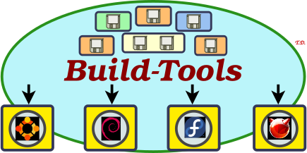

<h1 align="center">
 Build-Tools<br />
 <a href="https://www.nntb.no/~dreibh/build-tools/">
  <br />
  <span style="font-size: 75%;">https://www.nntb.no/~dreibh/build-tools</span>
 </a>
</h1>

# 💡 What are the Build-Tools?

The Build-Tools are a collection of scripts to help packaging open source software as:

- Debian Linux packages
- Ubuntu Linux packages
- Fedora Core Linux packages
- FreeBSD Ports packages

Furthermore, the Build-Tools provide helpful tools for:

- Versioning packages
- Checking manpages
- Preparing shell completion files
- Maintaining Linux Software Map (LSM) entries
- Create Debian Intent to Package (ITP) and Request for Sponsorship (RFS) mails
- as well as some other features


# 😀 A Detailed Example

<p class="center">
<span style="font-size:200%">
  <br/>
  <br/>WORK IN PROGRESS!
</span>
</p>


# 📦 Binary Package Installation

Please use the issue tracker at [https://github.com/dreibh/build-tools/issues](https://github.com/dreibh/build-tools/issues) to report bugs and issues!

## Ubuntu Linux

For ready-to-install Ubuntu Linux packages of Build-Tools, see [Launchpad PPA for Thomas Dreibholz](https://launchpad.net/~dreibh/+archive/ubuntu/ppa/+packages?field.name_filter=td-build-tools&field.status_filter=published&field.series_filter=)!

```bash
sudo apt-add-repository -sy ppa:dreibh/ppa
sudo apt-get update
sudo apt-get install td-build-tools
```

## Fedora Linux

For ready-to-install Fedora Linux packages of Build-Tools, see [COPR PPA for Thomas Dreibholz](https://copr.fedorainfracloud.org/coprs/dreibh/ppa/package/td-build-tools/)!

```bash
sudo dnf copr enable -y dreibh/ppa
sudo dnf install td-build-tools
```

## FreeBSD

WORK IN PROGRESS!

<!--
For ready-to-install FreeBSD packages of Build-Tools, it is included in the ports collection, see [FreeBSD ports tree index of net/td-build-tools/](https://cgit.freebsd.org/ports/tree/net/td-build-tools/)!

```bash
sudo pkg install build-tools
```

Alternatively, to compile it from the ports sources:

```bash
cd /usr/ports/net/td-build-tools
make
sudo make install
```
-->


# 💾 Build from Sources

Build-Tools is released under the [GNU General Public Licence&nbsp;(GPL)](https://www.gnu.org/licenses/gpl-3.0.en.html#license-text).

Please use the issue tracker at [https://github.com/dreibh/build-tools/issues](https://github.com/dreibh/build-tools/issues) to report bugs and issues!

## Development Version

The Git repository of the Build-Tools sources can be found at [https://github.com/dreibh/build-tools](https://github.com/dreibh/build-tools):

```bash
git clone https://github.com/dreibh/build-tools
cd build-tools
sudo ci/get-dependencies --install
cmake .
make
```

Note: The script [`ci/get-dependencies`](https://github.com/dreibh/build-tools/blob/master/ci/get-dependencies) automatically  installs the build dependencies under Debian/Ubuntu Linux, Fedora Linux, and FreeBSD. For manual handling of the build dependencies, see the packaging configuration in [`debian/control`](https://github.com/dreibh/build-tools/blob/master/debian/control) (Debian/Ubuntu Linux), [`build-tools.spec`](https://github.com/dreibh/build-tools/blob/master/rpm/td-build-tools.spec) (Fedora Linux), and [`Makefile`](https://github.com/dreibh/build-tools/blob/master/freebsd/td-build-tools/Makefile) FreeBSD.

Contributions:

* Issue tracker: [https://github.com/dreibh/build-tools/issues](https://github.com/dreibh/build-tools/issues).
  Please submit bug reports, issues, questions, etc. in the issue tracker!

* Pull Requests for Build-Tools: [https://github.com/dreibh/build-tools/pulls](https://github.com/dreibh/build-tools/pulls).
  Your contributions to Build-Tools are always welcome!

* CI build tests of Build-Tools: [https://github.com/dreibh/build-tools/actions](https://github.com/dreibh/build-tools/actions).

## Release Versions

See [https://www.nntb.no/~dreibh/build-tools/#current-stable-release](https://www.nntb.no/~dreibh/build-tools/#current-stable-release) for the release packages!


# 🔗 Useful Links

## Some Software using the Build-Tools

* [BibTeXConv – A BibTeX File Converter](https://www.nntb.no/~dreibh/bibtexconv/)
* [Dynamic Multi-Homing Setup (DynMHS)](https://www.nntb.no/~dreibh/dynmhs/)
* [FractGen – An extensible Fractal Generator software](https://www.nntb.no/~dreibh/fractalgenerator/)
* [HiPerConTracer – High-Performance Connectivity Tracer](https://www.nntb.no/~dreibh/hipercontracer/)
* [NetPerfMeter – A TCP/MPTCP/UDP/SCTP/DCCP Network Performance Meter Tool](https://www.nntb.no/~dreibh/netperfmeter/)
* [RSPLIB RSerPool Implementation and RSerPool Demo Tool](https://www.nntb.no/~dreibh/rserpool/)
* [RTP Audio – An Audio Streaming System for Transport Protocol and QoS Research Purposes](https://www.nntb.no/~dreibh/rtpaudio/)
* [SCTPLIB User-Space SCTP Implementation and Socket-API for SCTPLIB](https://www.nntb.no/~dreibh/sctplib/)
* [SubNetCalc – An IPv4/IPv6 Subnet Calculator](https://www.nntb.no/~dreibh/subnetcalc/)
* [System-Tools – Tools for Basic System Management](https://www.nntb.no/~dreibh/system-tools/)
* [TSCTP – An SCTP Test Tool](https://www.nntb.no/~dreibh/tsctp/)
* to be continued ...

## Projects using the Build-Tools

* [NorNet – A Real-World, Large-Scale Multi-Homing Testbed](https://www.nntb.no/)
* [GAIA – Cyber Sovereignty](https://gaia.nntb.no/)
* [RAKSHA – 5G Security for Critical Communications](https://www.simulamet.no/research/projects/raksha-5g-security-critical-communications)
* [5G-VINNI – 5G Verticals Innovation Infrastructure](https://www.5g-vinni.eu/)
* [HENCSAT – Highly Efficient Network Coding for Satellite Applications Test-bed](https://connectivity.esa.int/projects/hencsat)
* [SEARCH – Synthetic Healthcare Data Governance Hub](https://ihi-search.eu/)
* [MELODIC – Multi-Cloud Execution-Ware for Large-scale Optimised Data-Intensive Computing](https://melodic.cloud/)
* [NEAT – A New, Evolutive API and Transport-Layer Architecture for the Internet](https://neat.nntb.no/)
* [RITE  – Reducing Internet Transport Latency](https://web.archive.org/web/20221006013921/https://riteproject.eu/)
